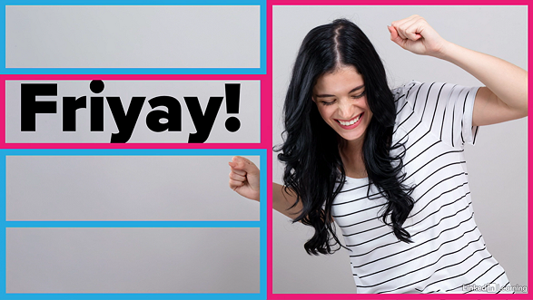

# Designing a Presentation
https://www.linkedin.com/learning/designing-a-presentation-14176816

## Developing Your Ideas
### Know Your Audience
- First need to do some research about audience
- Answer 3 questions
    - Who are they?
    - What do you want them to do?
    - What questions might they have?
- This helps to tailor the presentation to have the biggest impact
- One strategy is to develop some personas for your audience
- Sometimes you might not know exactly who your audience is
    - May need to make an educated guess
    - A decent guess is better than no guess at all

### Developing Ideas
- Give yourself plenty of prep time for making the presentation
- Take some time before making the actual presentation
    - Make a plan for your presentation
    - Think about your audience
- Start off with brain dumping your ideas
    - Doesn't have to be organized
    - That comes later

### Moodboards
- Moodboards are collections of different assets
- Helps to visualize links and connections with the audience
- Some examples
    - Colors
        - What colors are associated with their industry
        - Colors for nice contrast too
    - Fabrics
        - Do they wear a particular fabric?
        - Ex: white collar vs blue collar
    - Imagery
        - What images are relatable
        - What sort of art might they hang in their homes?
    - Type/Fonts
- Helps improve the feel and look of the presentation

### Creating An Outline
- Treat the audience as the "hero" of your "story"
    - Introduce the hero
    - Take the journey
    - Look at the challenges they'll face and overcome
    - Happy ending
- Sticky notes are useful

## Design Essentials
### Layout
- Space has 2 sides
    - Positive: there's things in it
    - Negative: generally nothing there
- Balance is important for layout
    - Not that this does not mean centering everything
    - Balance is possible with uneven distributions
- Example: 
    - Pink is positive space, blue is negative
    - The image looks balanced even though it's uneven distribution
    - The negative helps to support the positive

### Establishing a Layout
- General slides software provides support for basic layout
    - Horizontal/vertical
    - Relative to other objects
- A tip is to use the "rule of thirds"
    - Divides up the slide into a 3x3 grid
    - Trick is to make a 3x3 table and resize it to the whole table
    - You can add guidelines if the software supports it
- Each grid block helps give a better idea on object proportion
- Intersections are "action points"
    - Great for placing objects
    - Doesn't always have to be center, can just be touching it

### Type
- Types, aka fonts
- 2 types of fonts
    - Sans serif (ex: Arial)
    - Serif (ex: Times New Roman)
- Generally speaking, sans serif is good for headers and serif for paragraphs
    - However, paragraphs are rare in presentations
    - Free to use either font
- A trick for good header size is to zoom out of a presentation to 50%
    - Make sure the size is still legible
    - Can also view presentation on phone
- Another trick is to set header sizes relative to body text
    - Body text is a certain size
    - Ex: header is 1.25x the body and sub-header is 1.10x
- Type weights are also great for distinguishing between headers and body
    - Helps the audience to know which text is most important to focus on

### Bullets
- Bullet points are overused in presentations
    - Goal is to minimize text on slides
    - People use bullets to try and achieve that goal but it's still too much!
- Use no more than 5, 3 is ideal
- Make them short
- Animate them so they appear individually
    - One way is for past bullet points to have a faded font
    - People can still read them, they're just not in the spotlight anymore
- Save them for handout and takeaway

### Words
- People can't read or listen at the same time
    - If slides are too wordy, audience can't focus on your words
    - Leads to cognitive overload
- Bad things can result from wordy slides
    - People fall asleep
    - Stop paying attention since they think you're just going to repeat what
      they read

### Color
- Color is a subtle but super important part of presentations
    - Different cultural and emotional associations
    - Different things like ideas and industries are represented by certain colors
- Ex: Blue is a good color
    - Global positive color
    - A relaxing color, unlike red (which is good for grabbing attention)
- Consider the different cultures of your audience
- Take red for example
    - USA: danger, love
    - China: luck, happiness
    - India: purity
- Context also matters when combining colors
    - Red in horror movie vs red in Christmas
- A good tool to use is a color wheel
    - 3 primary and 3 secondaries
    - Tertiaries are mixing a primary and secondary
    - Tints are formed by adding black/white
- Some good websites for choosing palettes are
    - color.adobe.com
    - coolers.co
    - mycolor.space

### Contrast
- Contrast adds hierarchy and visual interest
- Size contrast
    - Eyes are drawn to the larger items
- Shape contrast
    - A grid of rectangles except 1 circle
    - Eyes go towards the odd one out
- Text types
    - Bolding, different font
    - Be careful to ensure you don't get too carried away
    - Contrast should still align with theme of presentation
- Color contrast
    - Find good contrasting colors
    - Also need to consider accessibility

### Images & Graphics
- *Images* are referring to pictures
- *Graphics* are more of diagrams that were drawn by hand or a tool
- Different formats and uses
    - JPEG: best for photos
    - PNG: photos and graphics, transparent
    - GIF: graphics, transparent, animated
    - SVG: graphics, transparent, infinitely scalable without losing quality

### Image Tips
- Images should be made as big as possible
- Full screen images are great
- There's a technique called *image bleed*
    - The image goes beyond the slide boundaries
    - Imitates how we focus on something in real life
- Smaller images should be framed within the slide
    - Give more room in the bottom
- 2 methods for captions
    - Add a space on bottom
    - Overlay the caption on top of the image
- Minimize text in images
- Here's a simple focus technique when you want to focus on a specific area of
  the image
    - Duplicate the image
    - In the original, turn down the brightness and saturation so it's black-and-white
    - In the copy, crop to shape in the area you want and overlay it
    - Creates a sort of spotlight effect
- Avoid stealing images from the Internet
- Here are some free image sites
    - pixabay.com
    - unsplash.com
    - pexels.com
    - commons.wikimedia.org

### Cropping Images
- This is the process of cropping a big image to fill the slide
- First drag the crop boundaries to the slide boundaries
    - Gives you an "outline" of where the slide is
- Move the image around until you're happy
    - Try to position the subject on the side
    - Consistent spacing around the edges

### Video
- Only include video in presentations if they help audience understand better
- Use autoplay
- Play video locally
    - Avoid links
    - Keep local video in same folder as slides
- Use high quality videos that can go full screen
- Clips should be short, <1min
    - If longer, tell audience what to expect and how long
    - Looping clips are good for intro, but cut the audio
- Play the video before presenting
    - Caches the video
    - Ensures nothing is wrong

### Backgrounds
- Backgrounds provide an environment for your slides
- Need to be subtle
    - Content shouldn't be battling background for attention
    - Background needs to contrast content
- Solid fills with contrast always works
- Dark backgrounds are great for large venues
    - More formal feel
    - Content stands out more
- Light backgrounds are better for small venues
    - Informal
- Gradients can subtly divert attention
    - Make sure not to overdo it
- Patterns add texture
    - Continue to be caution
- Images should be avoided as backgrounds
- Videos too, unless it actually adds something
    - Good example is as an intro/loading slide as the main content is being
      prepared

## Charts, Graphs, Tables
### Presenting Data
- Make sure you actually need to present this data in the first place
    - Audience can't really examine your graphs in detail
- Info needs to be clear and simple
- Never use 3D
- Use good color themes with contrast
- Labels should be clear as well
    - Don't color them
    - Labels should be helping the audience understand better
- Images can accompany labels to make them more memorable

### Tabular Info
- Tables are also not the most ideal in slides
- Use animations to add focus
    - Build up the table row by row as you progress
    - Highlight the areas you're talking about

## Transitions and Animations
### Transitions
- Fades are pretty general purpose
    - Other ones need to be relevant to context
    - Generally, the simpler ones work the best
- Morph transitions are also cool too
    - Involves several slides with seamless animations between them
    - Makes it look like it's all one big slide and you're panning around

### Animations
- Animations can spice up slides and retain audience animation
- Makes it more engaging
- Use caution though
    - Don't want things to fly all over the place

### Storyboarding
- We can use storyboards to plan out our transitions and animations
- Indicate the slide, and what behavior an element will exhibit
- Helps plan smoother and cleaner effects

## Finishing Touches
### Looping Intro
- Looping intros are great before the start of a presentation
    - Plays as the audience gets settled
    - Helps set the mood and tone
    - Looks more professional
    - Can provide context and background for the presentation
- You can use either a set of slides or an autoplay/autoloop movie
- Just make sure the transition to main slides are seamless

### Following Up
- Concluding presentation should be in the second to last slide
    - Reiterate the key takeaways
    - Pointers and data graphics
- Final slide is a follow up with helpful links
    - Shorten the links so it's easier to jot down
    - Combine all links into 1 resource (like a PDF) so you only need a single
      link
