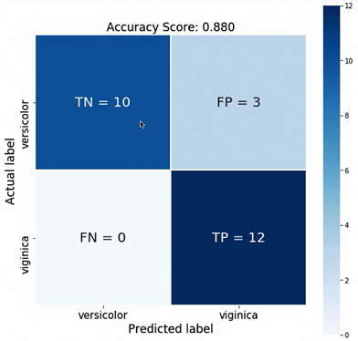
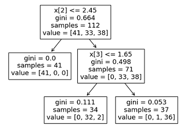
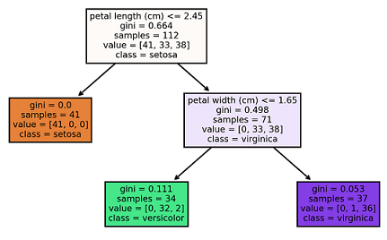
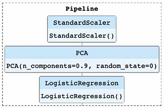

# Machine Learning with Scikit-Learn
https://www.linkedin.com/learning/machine-learning-with-scikit-learn

## Intro
- `scikit-learn` is a great and super popular package for ML
- Provides lots of different ML algorithms
- Comes pre-tuned with reasonable default hyperparameters
- Works well with other Python libraries
- Easy to switch between algorithms

## Supervised Learning
### Formatting Data
- `scikit-learn` requires data to be in a recognizable format
    - Features matrix is 2D, where rows are data and columns are features
    - Target vector is usually 1D, but doesn't have to eb
- We need to make sure our data can be recognized by `scikit-learn`
    - Usually `numpy` arrays
    - Can also use `pandas` data structures

```python
# import libraries
import pandas as pd
from sklearn.datasets import load_iris

# load dataset
data = load_iris()
df = pd.DataFrame(data.data, columns=data.feature_names)
df['species'] = data.target

# arrange data
feature_names = [
    'sepal length (cm)',
    'sepal width (cm)',
    'petal length (cm)',
    'petal width (cm)'
]
target_name = 'species'

# convert to NumPy arrays
x = df.loc[:, feature_names].values
y = df.loc[:, target_name].values

# verify dimensions are correct
print(x.shape)      # should be 2 dimensional
print(y.shape)      # should be 1 dimensional
```

### Linear Regression
- Linear regression can be thought of "finding a line of best-fit" for the data
- Models cannot contain any records with missing (null) data
- Removing records with missing data may not always be the best strategy
- `fit_intercept` is a hyperparameter that you can tune
    - Setting to `True` will adjust the y-intercept of the equation
    - Setting to `False` will have y-intercept be 0
- You can use `help(LinearRegression)` to get more info about the model

```python
# import libraries
import pandas as pd
from sklearn.linear_model import LinearRegression

# load dataset
df = pdf.read_csv("my/data/file,csv")

# check for missing values and remove records
print(df.isnull().sum())
df = df.dropna(how = "any")

# convert to NumPy
x = df.loc[:, ['x']].values
y = df.loc[:, 'y'].values

# train model
reg = LinearRegression(fit_intercept=True)
reg.fit(x,y)

# predict
reg.predict(x[0].reshape(-1,1))     # we reshape to convert single entry to 2D
reg.predict(X[0:10])

# evaluate model
print(reg.score(x,y))
```

### Train Test Split
- With train and test split, about 75% of data is train and 25% is test

```Python
from sklearn.model_selection import train_test_split

# train
x_train, x_test, y_train, y_test = train_test_split(x, y)
reg = LinearRegression(fit_intercept=True)
reg.fix(x_train, y_train)

# evaluate
print(reg.score(x_test, y_test))
```

### Logistic Regression
- Another name for classification models
- Advantages
    - Model training and predictions are pretty fast
    - Little to no tuning is usually required
    - Does well with small number of observations
- Calculates probabilities for each label and chooses the highest one

```Python
import pandas as pd
from sklearn.linear_model import LogisticRegression
from sklearn.model_selection import train_test_split
from sklearn.preprocessing import StandardScaler

# load dataset
df = pd.read_csv("iris.csv")

# split data
x_train, x_test, y_train, y_test = train_test_split(
    df[['petal length (cm)']],
    df['target']
)

# scale data
scaler = StandardScaler()
scaler.fit(x_train)
x_train = scaler.transform(x_train)
x_test = scaler.transform(x_test)

# train model
clf = LogisticRegression()
clf.fit(x_train, y_train)

# make predictions
test = x_test[0].reshape(1,-1)
print("prediction:", clf.predict(test[0]))
print("prob:", clf.predict_proba(test))

# score model
print(clf.score(x_test, y_test))
```
- `scaler.fit` should only be on training set
- `scaler.transform` is both training and test set
- A good metric to check is the confusion matrix:<br>

    - Top left says that it predicted versicolor correctly 10 times
    - Bottom right says the same for virginica
    - Top right says that it predicted virginica when it was actually 
      versicolor 3 times
    - Bottom left says it didn't mis-predict virginica any times

### Multiclass Logistic Regression
- One strategy for handling multiple classifications is to split task into
  multiple binary models
    - Also called *One vs Rest (OVR)* or *All vs One (OVA)*
- Example: classifying digits 0, 1, 2, and 3
    - Model 1: digit 0 vs digits 1, 2, 3
    - Model 2: digit 1 vs digits 0, 2, 3
    - Model 3: digit 2 vs digits 0, 1, 3
    - Model 4: digit 3 vs digits 0, 1, 2
- We choose the highest probability out of all 4 models

```Python
import pandas as pd
from sklearn.linear_model import LogisticRegression
from sklearn.model_selection import train_test_split
from sklearn.preprocessing import StandardScaler

# load and prep dataset
df = pdf.read_csv("4digits.csv")

x_train, x_test, y_train, y_test = train_test_split(
    df[[df.columns[:-1]]],
    df['label']
)

scaler = StandardScaler()
scaler.fit(x_train)
x_train = scaler.transform(x_train)
x_test = scaler.transform(x_test)

# multiclass model
clf = LogisticRegression(solver="liblinear", multi_class="ovr")
clf.fit(x_train, y_train)
print("Train accuracy:", clf.score(x_train, y_train))
print("Test accuracy:", clf.score(x_test, y_test))
```

### Decision Trees
- One important characteristic for ML algorithms is how interpretable it is
    - How easy is it to explain how the algorithm makes predictions
    - Ideally, the easier the better
- One interpretable algorithm is a decision tree
    - A tree containing different paths depending on features
    - Traverse the tree until we reach a leaf node
    - That's our decision
- `max_depth` is the hyperparameter to tune
    - Not always equal to actual depth
    - Pre-prunes the tree
- One advantage is that you don't need to standardize your data

```Python
import pandas as pd
from sklearn.datasets import load_iris
from sklearn.model_selection import train_test_split
from sklearn.tree import DecisionTreeClassifier

# load dataset
data = load_iris()
df = pd.DataFrame(data.data, columns=data.feature_names)
df['target'] = data.target

x_train, x_test, y_train, y_test = train_test_split(
    df[data.feature_names],
    df['target']
)

# build and run model
clf = DecisionTreeClassifier(max_depth=2)
clf.fit(x_train, y_train)

clf.predict(x_test.iloc[0].values.reshape(1,-1))
clf.predict(x_test[0:10])

print(clf.score(x_test, y_test))

# find optimal max_depth
max_depth_range = list(range(1,6))
accuracy = []
for depth in max_depth_range:
    clf = DecisionTreeClassifier(max_depth = depth)
    clf.fit(x_train, y_train)
    accuracy.append(clf.score(x_test, y_test))
```

### Visualize Decision Trees
```Python
import matplotlib.pyplot as plt
from sklearn import tree

# plot basic tree
tree.plot_tree(clf)
plt.show()
```



```python
# some visual improvements
fig, axes = plt.subplots(nrows=1, ncols=1, figsize=(4,4), dpi=300)
fn = [
    'sepal length (cm)',
    'sepal width (cm)',
    'petal length (cm)',
    'petal width (cm)'
]
cn = ['setosa', 'versicolor', 'virginica']

tree.plot_tree(clf, feature_names=fn, class_names=cn, filled=True)
```



### Bagged Trees
- A weakness of decision trees is that they tend to overfit on data
- Bagged trees try to fix this by limiting the growth of tree
    - Grows multiple trees and then combines
    - Hopes to minimize the individual weaknesses of the trees
- `n_estimators` is the hyperparameter to tune
    - Sets the number of individual trees in the overall network
    - This model takes longer to train the more estimators we have

```Python
import pandas as pd
from sklearn.model_selection import train_test_split
from sklearn.ensemble import BaggingRegressor

# load dataset
df = pd.read_csv("houseData.csv")
features = [
    "bedrooms",
    "bathrooms",
    "sqft_living",
    "sqft_lot",
    "floors"
]
x = df.loc[:, features]
y = df.loc[:, "price"].values

x_train, y_train, x_test, y_test = train_test_split(x, y)

# model
reg = BaggingRegressor(n_estimators=100)
reg.fit(x_train, y_train)

reg.predict(x_test.iloc[0].values.rehape(1,-1))
reg.predict(x_test[0:10])

print(reg.score(x_test, y_test))
```

### Random Forests
- While bagged trees are great, they also have a weakness
    - Strong features can dominate each individual tree
    - Results in many similar trees
- Random trees counter this by randomizing the split for features
    - Make each individual tree more "random"
- Literally the same code as `BaggingRegressor`, just replaced with
  `RandomForestRegressor`
    - One different thing is the `importance` metric

```Python
import pandas as pd
import numpy as np
from sklearn.model_selection import train_test_split
from sklearn.ensemble import RandomForestRegressor

# load dataset
df = pd.read_csv("houseData.csv")
features = [
    "bedrooms",
    "bathrooms",
    "sqft_living",
    "sqft_lot",
    "floors"
]
x = df.loc[:, features]
y = df.loc[:, "price"].values

x_train, y_train, x_test, y_test = train_test_split(x, y)

# model
reg = RandomForestRegressor(n_estimators=100)
reg.fit(x_train, y_train)

reg.predict(x_test.iloc[0].values.rehape(1,-1))
reg.predict(x_test[0:10])

print(reg.score(x_test, y_test))

# importance metric
importances = pd.DataFrame({
    "feature": x_train.columns,
    "importance": np.round(rfc.feature_importances_, 3)
})
importances = importances.sort_values("importance", ascending=False)
print(importances)
```

### Comparing Models
- Different models are suited to different purposes
- A great resource is the [scikit-learn cheat sheet](https://scikit-learn.org/stable/tutorial/machine_learning_map/index.html)
- Things to consider
    - Purpose of model
    - Size and quality of data
    - Time to train
    - How complicated it is
    - Strengths and weaknesses of each model

## Unsupervised Learning
- Only has the feature matrix
- Doesn't make predictions
- 2 types of unsupervised learning
    - Clustering
    - Dimensionality Reduction

### K-Means Clustering
- Example usage is grouping customers
    - Helps to more effectively market to similar people
- Most common clustering algorithm is K-means
- `n_clusters` is the hyperparameter to tune
    - Takes trial and error to figure it out
    - We use 3 in this example since we know there's 3 species
- It's a good idea to plot the data to see if you can visually identify any
  possible clusters

```Python
import pandas as pd
import matplotlib.pyplot as plt
from sklearn.datasets import load_iris
from sklearn.model_selection import train_test_split
from sklearn.preprocessing import StandardScaler 
from sklearn.cluster import KMeans

# load dataset
data = load_iris()
df = pd.DataFrame(data.data, columns=data.feature_names)

# standardize data
features = ['petal length (cm)', 'petal width (cm)']
x = df.loc[:, features].values
x = StandardScaler().fit_transform(x)

# plot data
df_plot = pd.DataFrame(x, columns=features)
df_plot.lot.scatter('petal length (cm)', 'petal width (cm)')
plt.xlabel('petal length (cm)')
plt.ylabel('petal wdith (cm)')
plt.show()

# cluster
kmeans = KMeans(n_clusters=3)
kmeans.fit(x)

# helpful info
lables = kmeans.labels_
centroids = kmeans.cluster_centers_

# visualize results
x = pd.DataFrame(x, columns=features)
colormap = np.array(['r','g','b'])
plt.scatter(x['petal length (cm)'], x['petal width (cm)'], c=colormap[labels])
plt.scatter(centroids[:,0], centroids[:,1], s=300, marker='x', c='k')
plt.xlabel('petal length (cm)')
plt.ylabel('petal wdith (cm)')
plt.show()
```

### PCA for Data Visualization
- PCA stands for *principal component analysis*
- Technique to reduce dimensionality of dataset
- Idea is to drop features without losing too much info
- Ex: if you have a column for petal length in inches, and another in
    centimeters, you probably can drop one of them
- `n_components` is what you want the final dimensionality to be
- Note that the final results probably won't have much meaning
- Checking the variance helps you estimate "data loss"
    - Reducing dimensions will inevitably cause *some* data loss
    - The higher the total sum, the more data has been kept

```Python
import matplotlib.,pyplot as plt
import pandas as pd
from sklearn.datasets import load_iris
from sklearn.preprocessing import StandardScaler
from sklearn.decomposition import PCA

# load dataset
data = load_iris()
df = pd.DataFrame(data.data, columns=data.feature_names)
df['target'] = data.target

speciesDict = {0: "setosa", 1: "versicolor", 3: "virginica"}
df.loc[:, 'target'] = df.loc[:, 'target'].apply(lambda x: speciesDict[x])

# standardize data
features = [
    'sepal length (cm)',
    'sepal width (cm)',
    'petal length (cm)',
    'petal width (cm)'
]
x = df.loc[:, features].values
x = StandardScaler.fit_transform(x)

# apply PCA to 2-dimensions
pca = PCA(n_components=2)
principalComponents = pca.fit_transform(x)
principalDf = pd.DataFrame(
    data=principalComponents,
    columns=[
        'principal component 1',
        'principal component 2'
    ]
)

# get variance after dimensionality reduction
pca.explained_variance_ratio_
sum(explained_variance_ratio_)
```

### Using PCA for Speed-Up
```Python
import pandas as pd
import numpy as np
from sklearn.datasets import load_iris
from sklearn.model_selection import train_test_split
from sklearn.preprocessing import StandardScaler
from sklearn.decomposition import PCA
from sklearn.linear_model import LogisticRegression

df = pd.read_csv("file.csv")
x_train, x_test y_train, y_test = train_test_split(df[df.columns[:-1], df['label']])

scaler = StandardScaler()
scaler.fit(x_train)
x_train = scaler.transform(x_train)
x_test = scaler.transform(x_test)

# integrate PCA
pca = PCA(n_components=0.9)
pca.fit(x_train)

x_train = pca.transform(x_train)
x_test = pca.transform(x_test)

clf = LogisticRegression()
clf.fit(x_train, y_train)
```
- Note that when `n_components` is a fraction, `scikit-learn` will choose min
  number of principal components such that `n_components` variance is achieved

### Pipelines
- Pipelines in `scikit-learn` helps to connect different algorithms together
    - In a clean and organized way
- You can also visualize it to see the different steps the pipeline takes<br>


```Python
from sklearn.pipeline import Pipeline

pipe = Pipeline([
    ('scaler', StandardScaler()),
    ('pca', PCA(n_components=0.9)),
    ('logistic', LogisticRegression())
])
pipe.fit(x_train, y_train)
print(pipe.score(x_test, y_test))

# visualize pipeline
from sklearn import set_config
set_config(display="diagram")
print(pipe)
```
